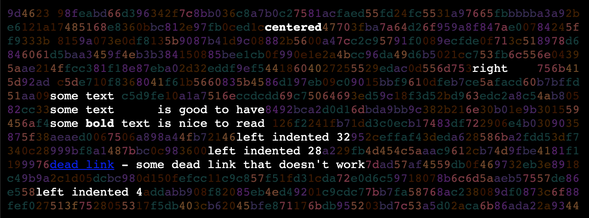

# deadbeef - fancypants webpage renderer
behold, my 2006 php ascii art renderer ported in 2019 to **javascript**! (hooray)  (see the [php version](../../../deadbeef-php))

<h1> 0xdeadbeef</h1>
<p> dead beef is a fancy ascii rendering utility.  it will place
random ascii characters in between the empty spaces of a paragraph of
text.

<!--<p> hit reload on the page to see the ascii characters change
randomly.-->
`"it's magic! and you'll wow your friends" - says your mom`



# example code

you can see, we support a html-a-like markup, mainly l, c, r tags are the new ones

```
let db = new deadbeef()

let page_text = ` 
<c><b>centered</b></c> 

<r>right    </r> 
some text 
some text      is good to have
some <b>bold</b> text is nice to read 
<l pos=32>left indented 32</l>
<l pos=28>left indented 28</l>
<a href="dead link">dead link</a> - some dead link that doesn't work

<l pos=4>left indented 4</l>

`

let html = db.DrawPage( page_text, 6, 80, 15 )
```

[see here](deadbeef_test.html) for a working example


<h2>License</h2>
<pre>   deadbeef - fancypants webpage renderer
   Copyright (c) 2006, 2019 kevin meinert all rights reserved

   This library is free software; you can redistribute it and/or
   modify it under the terms of the GNU Lesser General Public
   License as published by the Free Software Foundation; either
   version 2.1 of the License, or (at your option) any later version.

   This library is distributed in the hope that it will be useful,
   but WITHOUT ANY WARRANTY; without even the implied warranty of
   MERCHANTABILITY or FITNESS FOR A PARTICULAR PURPOSE.  See the GNU
   Lesser General Public License for more details.

   You should have received a copy of the GNU Lesser General Public
   License along with this library; if not, write to the Free Software
   Foundation, Inc., 51 Franklin Street, Fifth Floor, Boston, MA
   02110-1301  USA
   </pre>
</body></html>
